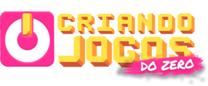
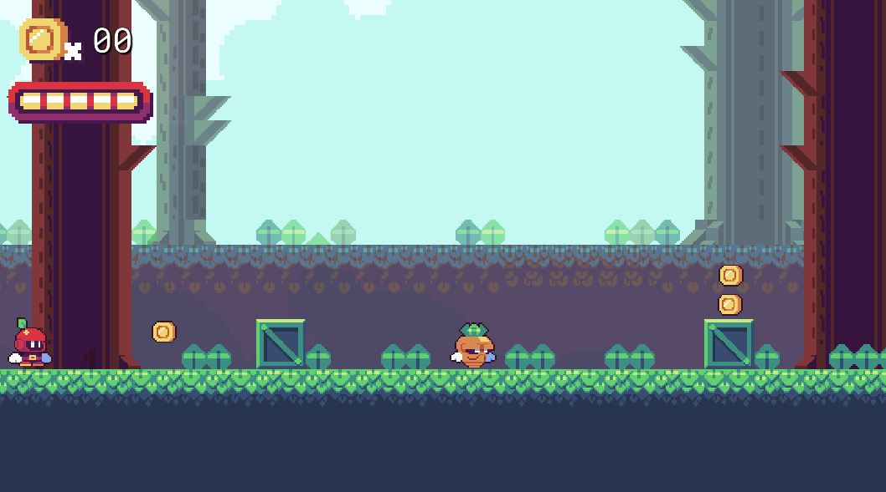

     
  
  
     

  
    
    
Workshop criando jogos do zero do <a href = "https://csjacademy.com.br/"> CSJ Academy. </a>Nesse workshop foi feito um jogo de plataforma 2D incluindo movimentos do personagem(andar e pular), uso do tilemap e uso da ferramenta Cinemachine.

